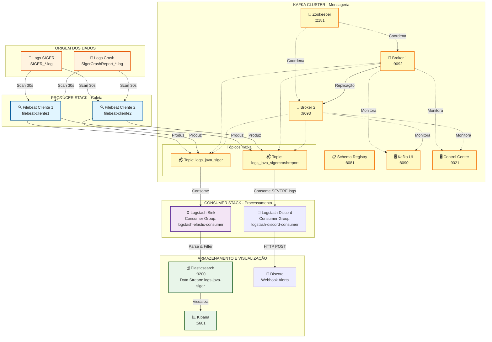

# Kafka Log Pipeline

Pipeline distribuído de processamento de logs Java usando Apache Kafka como backbone central de mensageria.

## 📊 Arquitetura



## 🎯 Visão Geral

Sistema de coleta, transmissão e armazenamento de logs Java (SIGER) com arquitetura baseada em:
- **Filebeat**: Coleta de logs de múltiplos clientes
- **Kafka**: Mensageria distribuída com alta disponibilidade
- **Logstash**: Processamento e transformação de logs
- **Elasticsearch**: Armazenamento indexado
- **Kibana**: Visualização e análise

## 🚀 Início Rápido

### Iniciar o Pipeline Completo
```bash
cd scripts
start-stack.bat
```

### Parar o Pipeline
```bash
cd scripts
stop-stack.bat
```

## 📦 Componentes

### 1. Kafka Cluster (`kafka-cluster/`)
Infraestrutura central de mensageria com alta disponibilidade:

- **Zookeeper** (`:2181`) - Coordenação do cluster
- **2 Brokers Kafka** (`:9092`, `:9093`) - Cluster com replicação
  - Replication Factor: 2
  - Min In-Sync Replicas: 2
  - 6 partições por tópico
- **Schema Registry** (`:8081`) - Gerenciamento de schemas Avro
- **Kafka Connect** (`:8083`) - Framework para conectores
- **Control Center** (`:9021`) - Interface Confluent
- **Kafka UI** (`:8090`) - Interface web alternativa
- **REST Proxy** (`:8082`) - API REST

### 2. Producer Stack (`logs-siger-producer-filebeat/`)
Coleta de logs com múltiplos clientes Filebeat:

**Filebeat Instances:**
- `filebeat-cliente1` - Coleta logs do sample-logs-1
- `filebeat-cliente2` - Coleta logs do sample-logs-2

**Configuração de Inputs:**
- **logs-siger-java**: Logs normais → Topic `logs_java_siger`
  - Pattern: `SIGER_*_*_[0-9]*_[0-9]*_*.*`
- **logs-sigercrash-java**: Logs de crash → Topic `logs_java_sigercrashreport`
  - Pattern: `SigerCrashReport_*_*_[0-9]*_[0-9]*_*.*`

**Características:**
- Encoding CP1252 (Windows)
- Multiline parsing para stack traces Java
- Scan a cada 30s
- Roteamento dinâmico por tópico
- Particionamento por file path

### 3. Consumer Stack

#### 3.1 Elasticsearch Consumer (`logs-siger-consumer-es/`)
Processamento e armazenamento de logs:

**Logstash Sink:**
- Consome do topic `logs_java_siger`
- Consumer Group: `logstash-elastic-consumer`

**Pipeline de Processamento:**
1. **GROK Parsing** - Extrai campos estruturados:
   - `log.session_id`, `log.sequence`, `log.thread_id`
   - `log.timestamp_str`, `log.level`, `log.logger`
   - `log.message_full`

2. **Error Extraction** - Para logs SEVERE/WARNING:
   - Identifica tipo de exceção (`error.type`)
   - Captura mensagens de erro
   - Detecta "Caused by" chains

3. **Date Conversion**:
   - Formato: `YYYY-MM-dd HH:mm:ss,SSS`
   - Timezone: America/Sao_Paulo

4. **Field Cleanup** - Remove campos temporários

**Elasticsearch** (`:9200`)
- Data Stream: `logs-java-siger`
- Namespace: `siger`
- Dataset: `java`

**Kibana** (`:5601`)
- Interface de visualização e análise

#### 3.2 Discord Alert Consumer (`logs-siger-consumer-discord/`)
Notificações em tempo real para Discord:

**Logstash Discord:**
- Consome do topic `logs_java_sigercrashreport`
- Consumer Group: `logstash-discord-consumer`
- **Filtro**: Apenas logs com `level = SEVERE`

**Notificação:**
- Envia alerta via Discord Webhook
- Inclui: Cliente, Timestamp, Logger, Tipo de Erro, Mensagem
- Bot: "SIGER Alert Bot"
- Rate-limit aware (5 msgs/2s)

**Webhook URL**: Configurado via variável de ambiente `DISCORD_WEBHOOK_URL`

## 🔄 Fluxo de Dados

### Fluxo Principal (Elasticsearch)
```
[Arquivos .log] 
    ↓ Filebeat (scan 30s, encoding CP1252, multiline parsing)
[Kafka Topic: logs_java_siger]
    ↓ Logstash Consumer
[Parse GROK → Extract Errors → Convert Dates → Cleanup]
    ↓ Elasticsearch Output
[Data Stream: logs-java-siger]
    ↓ Query API
[Kibana Dashboard]
```

### Fluxo de Alertas (Discord)
```
[Arquivos CrashReport.log]
    ↓ Filebeat (scan 30s, multiline parsing)
[Kafka Topic: logs_java_sigercrashreport]
    ↓ Logstash Discord Consumer
[Filter: SEVERE only → Parse → Format Message]
    ↓ HTTP Webhook
[Discord Channel] 🚨 Alerta em tempo real!
```

## 📝 Formato de Log Esperado

```
ABCD 123456 789012 2024-11-17 10:30:45,123 INFO  com.example.MyClass Mensagem do log
ABCD 123456 789012 2024-11-17 10:30:46,456 SEVERE com.example.MyClass Erro!
java.lang.RuntimeException: Descrição do erro
    at com.example.MyClass.method(MyClass.java:42)
    at com.example.Main.main(Main.java:10)
Caused by: java.lang.NullPointerException
    at com.example.Helper.process(Helper.java:15)
```

## 🌐 Portas Expostas

| Serviço | Porta | Descrição |
|---------|-------|-----------|
| Kafka Broker 1 | 9092 | Kafka externo |
| Kafka Broker 2 | 9093 | Kafka externo (replica) |
| Zookeeper | 2181 | Coordenação do cluster |
| Schema Registry | 8081 | API de schemas |
| Kafka Connect | 8083 | API de conectores |
| REST Proxy | 8082 | Kafka REST API |
| Kafka UI | 8090 | Interface web |
| Control Center | 9021 | Confluent Control Center |
| Elasticsearch | 9200 | API Elasticsearch |
| Kibana | 5601 | Interface de visualização |

## 🎛️ Monitoramento

- **Kafka UI**: http://localhost:8090
- **Control Center**: http://localhost:9021
- **Kibana**: http://localhost:5601
- **Elasticsearch**: http://localhost:9200

## ⚙️ Configurações Importantes

### Kafka
- **Replication Factor**: 2
- **Min In-Sync Replicas**: 2
- **Partições**: 6 por tópico
- **Required ACKs**: 1 (Filebeat)

### Filebeat
- **Scan Frequency**: 30s
- **Close Inactive**: 1m
- **Clean Inactive**: 72h
- **Encoding**: CP1252

### Logstash
- **Memory**: 256MB-512MB
- **Codec**: JSON
- **Timezone**: America/Sao_Paulo

### Elasticsearch
- **Mode**: Single-node
- **Memory**: 512MB-1GB
- **Security**: Desabilitada (desenvolvimento)

## 📁 Estrutura do Projeto

```
kafka-log-pipeline/
├── kafka-cluster/                    # Cluster Kafka + ferramentas
│   ├── docker-compose.yml
│   └── prometheus.yml
├── logs-siger-producer-filebeat/     # Coleta de logs
│   ├── docker-compose.yml
│   ├── filebeat.yml
│   ├── sample-logs-1/               # Logs cliente 1
│   └── sample-logs-2/               # Logs cliente 2
├── logs-siger-consumer-es/           # Processamento e armazenamento
│   ├── docker-compose.yml
│   └── logstash-sink/
│       └── pipeline/
│           └── logstash.conf
├── logs-siger-consumer-discord/      # Alertas Discord
│   ├── docker-compose.yml
│   ├── README.md
│   └── logstash-discord/
│       └── pipeline/
│           └── logstash.conf
└── scripts/                          # Scripts de automação
    ├── start-stack.bat
    └── stop-stack.bat
```

## 🔧 Troubleshooting

### Verificar status dos containers
```powershell
docker ps
```

### Ver logs de um serviço específico
```powershell
docker logs -f <container_name>
```

### Verificar tópicos Kafka
Acesse Kafka UI em http://localhost:8090

### Verificar índices Elasticsearch
```powershell
curl http://localhost:9200/_cat/indices?v
```

### Limpar volumes e recomeçar
```bash
cd scripts
stop-stack.bat
docker volume prune -f
start-stack.bat
```

## 🎯 Casos de Uso

- **Centralização de Logs**: Coleta de logs de múltiplos servidores/clientes
- **Análise em Tempo Real**: Processamento e indexação contínua
- **Troubleshooting**: Busca e análise de erros com Kibana
- **Auditoria**: Histórico completo de logs com timestamps precisos
- **Monitoramento**: Dashboards de métricas e alertas
- **Alertas Críticos**: Notificações instantâneas no Discord para erros SEVERE
- **Equipes Distribuídas**: Alertas em canais Discord para resposta rápida

## 📚 Tecnologias

- **Apache Kafka 7.5.0** (Confluent Platform)
- **Filebeat 8.11.1** (Elastic Beats)
- **Logstash 8.11.1** (Elastic Stack)
- **Elasticsearch 8.11.1** (Elastic Stack)
- **Kibana 8.11.1** (Elastic Stack)
- **Docker & Docker Compose**

## 🔒 Notas de Segurança

⚠️ **Atenção**: Esta configuração é para ambiente de **desenvolvimento**. Para produção:

- Habilitar autenticação no Elasticsearch
- Configurar TLS/SSL no Kafka
- Implementar controle de acesso (ACLs)
- Configurar backup dos volumes
- Ajustar limites de recursos
- Habilitar autenticação no Schema Registry e Connect

## 📄 Licença

Este projeto é um exemplo educacional/demonstrativo do sistema de logs SIGER.
