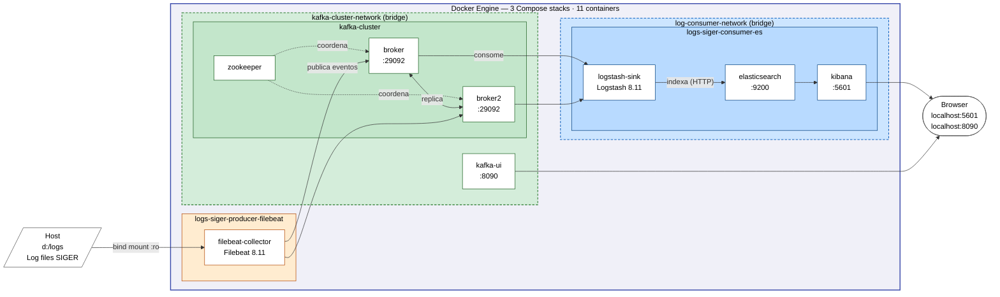

# Roteiro do Vídeo — Docker Container Pipeline

**Duração alvo:** ~11:00 min  
**Projeto:** Pipeline de logs SIGER com Filebeat → Kafka → Logstash → Elasticsearch → Kibana  
**Foco:** Primitivas Docker — Compose, imagens, cgroups, namespaces, volumes, restart policy, healthcheck, escalabilidade

> **Nota de planejamento:** A apresentação total é de 20 min.
> Planejar ~9 min de slides (teoria) + ~11 min de vídeo integrado.

---

## Distribuição de Cenas

| Cena | Tema | Tempo | Conceito Docker |
|------|------|-------|-----------------|
| 0 | Introdução e topologia | 0:00 – 0:50 | Visão geral |
| 1 | Estrutura de configuração | 0:50 – 2:30 | Compose + imagens + bind mounts + camadas |
| 2 | Deploy e inspeção de namespaces | 2:30 – 4:00 | Namespaces de rede + PID + port mapping |
| 3 | Monitoramento e desempenho sob carga | 4:00 – 5:30 | cgroups + I/O de disco + comportamento sob carga |
| 4 | Restart policy e healthcheck | 5:30 – 6:45 | Restart policy + healthcheck |
| 5 | Named volumes e DNS interno | 6:45 – 7:45 | Named volumes + DNS Docker |
| 6 | Escalabilidade horizontal | 7:45 – 8:45 | docker compose --scale |
| 7 | Métricas de startup e conclusão | 8:45 – 10:45 | Avaliação de desempenho |

---

## Cena 0 — Introdução: O Problema e a Topologia (0:00 – 0:50)

**Tela:** imagem estática do diagrama abaixo (exportar como PNG)



**Narração:**

> "O sistema que vamos demonstrar é um pipeline de coleta e análise de logs em produção.
> O SIGER é um sistema Java utilizado por múltiplos clientes, cada um gerando arquivos de
> log continuamente no servidor.
>
> Nossa solução conecta quatro componentes em cadeia: o **Filebeat** lê os arquivos e publica
> no **Kafka**. O **Logstash** consome, parseia e indexa no **Elasticsearch**. O **Kibana**
> fecha com visualização em tempo real. São 11 containers orquestrados pelo Docker Compose
> em três stacks independentes — e vamos começar pelo que define tudo isso: os arquivos
> de configuração."

---

## Cena 1 — Estrutura de Configuração: Compose e Imagens (0:50 – 2:30)

**Tela:** explorador de arquivos do VS Code mostrando a estrutura de diretórios

```
kafka-log-pipeline/
├── kafka-cluster/
│   └── docker-compose.yml       ← cria a rede e os brokers
├── logs-siger-consumer-es/
│   └── docker-compose.yml       ← ES, Logstash, Kibana
└── logs-siger-producer-filebeat/
    └── docker-compose.yml       ← Filebeat
```

Abrir [kafka-cluster/docker-compose.yml](kafka-cluster/docker-compose.yml) e mostrar a declaração de rede no final:
```yaml
networks:
  kafka-cluster-network:
    driver: bridge
    name: kafka-cluster-network
```

Abrir [logs-siger-consumer-es/docker-compose.yml](logs-siger-consumer-es/docker-compose.yml) e mostrar:
```yaml
networks:
  kafka-cluster-network:
    external: true          # ← referencia a rede criada pelo outro Compose
    name: kafka-cluster-network
```

Abrir [logs-siger-producer-filebeat/docker-compose.yml](logs-siger-producer-filebeat/docker-compose.yml) e mostrar o mesmo padrão `external: true`.

Agora percorrer a anatomia completa do serviço `elasticsearch` no Compose, campo por campo:
```yaml
elasticsearch:
  image: docker.elastic.co/elasticsearch/elasticsearch:8.11.1  # ← imagem do registry
  container_name: elasticsearch
  networks:
    - log-consumer-network   # ← qual namespace de rede
  volumes:
    - es-data:/usr/share/elasticsearch/data  # ← volume nomeado (persistência)
  mem_limit: 1300m           # ← cgroup de memória
  ulimits:
    memlock: { soft: -1, hard: -1 }  # ← limite de kernel exposto pelo Docker
  environment:               # ← variáveis injetadas no processo
    - ES_JAVA_OPTS=-Xms768m -Xmx768m
    - bootstrap.memory_lock=true
  restart: unless-stopped    # ← política de recuperação
  healthcheck:               # ← critério de "saudável"
    test: ["CMD-SHELL", "curl -fsS http://localhost:9200/_cluster/health"]
    interval: 20s
    retries: 5
```

Abrir [logs-siger-producer-filebeat/docker-compose.yml](logs-siger-producer-filebeat/docker-compose.yml) e destacar os volumes do Filebeat, contrastando os dois tipos:
```yaml
volumes:
  - ../logs:/usr/share/logs:ro              # bind mount: caminho do HOST mapeado
  - ./filebeat.yml:/config/filebeat.yml:ro  # bind mount: arquivo do HOST mapeado
  - filebeat-collector-data:/usr/share/filebeat/data  # named volume: gerenciado pelo Docker
```

Depois, no terminal, mostrar as imagens presentes e suas camadas:
```powershell
# Imagens puxadas dos registries com tamanhos
docker image ls --format "table {{.Repository}}\t{{.Tag}}\t{{.Size}}"

# Camadas internas da imagem do Elasticsearch (union filesystem)
docker image history docker.elastic.co/elasticsearch/elasticsearch:8.11.1
```

**Narração:**

> "O projeto tem três arquivos Compose separados — cada um é um stack independente.
> O `kafka-cluster` cria a rede `kafka-cluster-network`. Os outros dois stacks declaram
> essa rede como `external: true`, o que diz ao Docker: 'essa rede já existe, não a crie,
> apenas conecte meus containers a ela'. Essa é a forma de compor múltiplos Compose files
> sem acoplá-los em um único arquivo monolítico.
>
> Olhando a definição do `elasticsearch`, vemos o Compose como uma especificação declarativa
> completa: qual imagem, qual rede, quais volumes, qual limite de memória, quais variáveis
> de ambiente, como recuperar de falhas e qual critério define que está saudável.
>
> No Filebeat vemos os dois tipos de montagem lado a lado. Os **bind mounts** mapeiam
> caminhos reais do host para dentro do container — o Filebeat lê os logs do SIGER
> diretamente do sistema de arquivos da máquina, e a flag `:ro` impede qualquer escrita.
> O **named volume** `filebeat-collector-data` é diferente: o Docker gerencia o local de
> armazenamento no host, e o volume sobrevive independente do container.
>
> O `docker image ls` mostra as imagens com seus tamanhos — o Elasticsearch é pesado
> porque carrega uma JVM completa, enquanto o Filebeat é muito mais leve.
> O `image history` revela as camadas internas: cada linha é uma instrução do Dockerfile
> original que gerou aquela imagem, empilhadas em um union filesystem. Camadas idênticas
> entre imagens — como a base do Linux — são compartilhadas no disco e nunca duplicadas."

---

## Cena 2 — Deploy e Inspeção de Namespaces (2:30 – 4:00)

**Tela:** terminal

```powershell
# Subir o stack completo
.\scripts\start-stack.bat

# Listar containers com status e imagem
docker ps --format "table {{.Names}}\t{{.Status}}\t{{.Image}}"

# Ver as redes criadas
docker network ls --filter "name=kafka\|log"

# Inspecionar containers em cada namespace de rede
docker network inspect kafka-cluster-network `
  --format "{{range .Containers}}{{.Name}} -> {{.IPv4Address}}{{println}}{{end}}"

docker network inspect log-consumer-network `
  --format "{{range .Containers}}{{.Name}} -> {{.IPv4Address}}{{println}}{{end}}"

# Provar o isolamento: broker não enxerga o elasticsearch
docker exec broker ping -c 2 elasticsearch
# → ping: elasticsearch: Name or service not known

# Mapeamento de portas: como o host enxerga os containers
docker ps --format "table {{.Names}}\t{{.Ports}}"
# → kibana: 0.0.0.0:5601->5601/tcp
# → elasticsearch: 0.0.0.0:9200->9200/tcp
# → kafka-ui: 0.0.0.0:8090->8080/tcp  (porta interna diferente da externa)

# PID namespace: dentro do container só existem os próprios processos
docker exec elasticsearch ps aux
# → PID 1: java (processo principal do ES)
# → PID ~30-50: threads da JVM

# No host: cada container é um processo comum visto pelo kernel
docker ps -q | ForEach-Object { docker inspect $_ --format "{{.Name}}: PID {{.State.Pid}}" }
# → cada container tem um PID real no host, completamente diferente do PID 1 interno
```

**Narração:**

> "Ao executar o start, o Docker Compose processa os três arquivos em ordem: primeiro o
> kafka-cluster cria a rede e sobe os brokers. Os outros dois stacks encontram a rede
> já existente e conectam seus containers a ela.
>
> Cada rede bridge é um **namespace de rede** isolado no kernel. Inspecionando as duas redes
> vemos que os brokers Kafka têm IPs dentro de `kafka-cluster-network`, e o Elasticsearch
> tem IP dentro de `log-consumer-network` — dois espaços de endereçamento completamente
> separados rodando na mesma máquina física.
>
> O ping confirma o isolamento: o broker não consegue resolver o nome `elasticsearch`
> porque esse hostname só existe dentro do namespace de rede do `log-consumer-network`.
> O único container com acesso às duas redes é o Logstash, que por isso tem duas interfaces
> virtuais, uma em cada namespace.
>
> O mapeamento de portas mostra como o namespace é seletivamente permeável ao host: o
> Kibana escuta na porta 5601 dentro do seu namespace, e o Docker cria uma regra de NAT
> que redireciona tráfego externo de `0.0.0.0:5601` para dentro do container. O Kafka-UI
> é o exemplo mais claro — a porta interna é 8080, mas o host expõe como 8090.
> Sem esse mapeamento declarado no Compose, o container seria completamente invisível
> para qualquer processo fora do namespace.
>
> O namespace de PID completa o quadro de isolamento. Dentro do container, o `ps aux`
> mostra apenas os processos do Elasticsearch — o PID 1 é a JVM, e o container não
> enxerga nenhum dos outros 10 containers rodando na mesma máquina. Do lado do host,
> o mesmo processo existe com um PID completamente diferente. Dois sistemas de numeração
> paralelos, totalmente independentes, implementados pelo kernel sem nenhuma virtualização
> de hardware."

---

## Cena 3 — Monitoramento e Desempenho sob Carga (4:00 – 5:30)

**Tela:** dividida — Kibana em `localhost:5601` (esquerda) + terminal (direita)

**Parte A — gerar carga (burst de logs):**

```powershell
# Parar o Filebeat e apagar o volume de estado (offset registry)
docker stop filebeat-collector
docker volume rm filebeat-collector-data

# Subir novamente — sem o offset salvo, o Filebeat reprocessa todos os logs desde o início
docker compose -f d:\kafka-log-pipeline\logs-siger-producer-filebeat\docker-compose.yml up -d
# → burst imediato: todos os eventos entram no Kafka de uma vez
```

**Parte B — observar métricas com docker stats:**

```powershell
# CPU, memória, rede e I/O de disco por container (atualiza a cada 2s)
docker stats --format "table {{.Name}}\t{{.CPUPerc}}\t{{.MemUsage}}\t{{.NetIO}}\t{{.BlockIO}}"
```

Apontar na tela durante o burst:
1. Logstash: `CPU %` acima de **300%** (até 334% medido) — processando batch massivo
2. Logstash: `MEM USAGE` em **~686 MiB / 768 MiB** — cgroup contendo quase 90% do heap
3. Elasticsearch: `MEM USAGE` em **~1.23 GiB / 1.27 GiB** — próximo do teto do cgroup
4. `BLOCK I/O` do Elasticsearch: escrita em disco dos índices Lucene durante indexação

**Parte C — provar o cgroup no kernel:**

```powershell
# Provar que o cgroup existe como objeto real do kernel
# (Docker Desktop/WSL2 usa cgroup v2)
docker exec elasticsearch cat /sys/fs/cgroup/memory.max
# → 1363148800  (= 1300 MB declarados no Compose, convertidos para bytes pelo kernel)

# Ver onde o es-data está montado dentro do container
docker inspect elasticsearch `
  --format "{{range .Mounts}}{{.Type}} | {{.Name}}{{.Source}} -> {{.Destination}}{{println}}{{end}}"
```

**Narração:**

> "Para tornar as métricas visíveis, geramos uma carga real: apagamos o volume de estado
> do Filebeat, forçando-o a reprocessar todos os logs desde o início de uma só vez.
> O Kafka recebe uma rajada de eventos simultaneamente.
>
> O `docker stats` é a janela direta para os cgroups em execução. Vemos o Logstash com
> CPU acima de 300% — isso não é um bug: o cgroup permite usar múltiplos núcleos, e
> o valor é relativo a um núcleo. O heap do Logstash chega a 686 MB dos 768 MB permitidos
> — o kernel bloqueia qualquer alocação além desse teto.
>
> O Elasticsearch aparece com `BLOCK I/O` crescente: é a escrita dos índices Lucene em
> disco, passando pelo namespace de mount do container e caindo no volume Docker.
>
> Podemos confirmar o cgroup diretamente no kernel: `cat /sys/fs/cgroup/memory.max`
> dentro do container retorna 1.363.148.800 — exatamente 1300 MB em bytes. O Docker
> traduziu `mem_limit: 1300m` do Compose em uma entrada no subsistema cgroup v2 do
> kernel Linux. Não é uma verificação em userspace — é uma restrição do próprio kernel.
>
> O `inspect` mostra os mounts: tipo `volume` é o `es-data` gerenciado pelo Docker;
> tipo `bind` são caminhos reais do host mapeados dentro do namespace de mount."

---

## Cena 4 — Restart Policy e Healthcheck (5:30 – 6:45)

**Tela:** Kafka-UI em `localhost:8090` (esquerda, aba Consumer Groups) + terminal (direita)

```powershell
# Confirmar a restart policy configurada (sem container_name, o Compose nomeia como <projeto>-<serviço>-<n>)
docker ps --filter "name=logstash" --format "{{.Names}}"
# → logs-siger-consumer-es-logstash-sink-1

# Confirmar a restart policy via Compose ps
docker compose -f d:\kafka-log-pipeline\logs-siger-consumer-es\docker-compose.yml ps logstash-sink
# → logs-siger-consumer-es-logstash-sink-1   running(healthy)

# Matar o Logstash abruptamente com SIGKILL via Compose (kill usa o nome do serviço)
docker compose -f d:\kafka-log-pipeline\logs-siger-consumer-es\docker-compose.yml kill logstash-sink
# exit code 137 (128 + SIGKILL=9)

# Mostrar o container exited com o código de saída
docker ps -a --filter "name=logstash" --format "{{.Names}}: {{.Status}}"
# → logs-siger-consumer-es-logstash-sink-1: Exited (137) X seconds ago

# Aguardar ~20s observando o consumer lag crescer no Kafka-UI

# Recuperar via Compose (em produção Linux o daemon faria isso automaticamente)
docker compose -f d:\kafka-log-pipeline\logs-siger-consumer-es\docker-compose.yml up -d logstash-sink
# → Container logs-siger-consumer-es-logstash-sink-1 Started
```

No Kafka-UI: mostrar consumer lag **crescendo** após o kill, depois **caindo** após o restart.

**Narração:**

> "A `restart policy` `unless-stopped` é uma instrução ao Docker daemon: reiniciar o
> container em qualquer saída anormal, mas respeitar quando um operador para
> intencionalmente com `docker stop`.
>
> Usamos `docker compose kill` para matar o Logstash com SIGKILL — o processo termina
> imediatamente, sem cleanup. O exit code 137 confirma: 128 mais o número do sinal
> SIGKILL (9). Qualquer código diferente de zero seria tratado como falha pelo daemon.
>
> Note que sem `container_name` explícito no Compose, o Docker nomeia o container
> automaticamente como `<projeto>-<serviço>-<índice>`. Isso é necessário para suportar
> o escalonamento que veremos na próxima cena — com um nome fixo, só poderia existir
> uma instância.
>
> No Kafka-UI vemos o lag do consumer group crescendo: mensagens continuam chegando
> pelo Filebeat, mas não há consumidor ativo. Simulamos aqui o que o Docker daemon
> faz automaticamente em ambientes Linux de produção — subimos o serviço de volta
> via Compose. O daemon reconecta o Logstash ao Elasticsearch via DNS interno,
> o consumer group retoma do offset onde parou, e o lag começa a cair."

---

## Cena 5 — Named Volumes e DNS Interno (6:45 – 7:45)

**Tela:** Kibana (esquerda) + terminal (direita)

```powershell
# Matar o Elasticsearch com SIGKILL
docker kill elasticsearch

# Logstash registra erros mas permanece vivo — não abandona a conexão
docker logs logstash-sink --tail 10
# → Connection refused to elasticsearch:9200

# Mostrar exit code 137
docker ps -a --filter name=elasticsearch --format "{{.Names}}: {{.Status}}"
# → elasticsearch: Exited (137) X seconds ago

# O volume foi preservado — dados intactos mesmo com o container destruído
docker volume inspect es-data --format "Mountpoint: {{.Mountpoint}}"

# Recuperar o ES via Compose
docker compose -f d:\kafka-log-pipeline\logs-siger-consumer-es\docker-compose.yml up -d elasticsearch

# Aguardar ES ficar healthy e confirmar DNS interno via Logstash
docker inspect elasticsearch --format "Health: {{.State.Health.Status}}"
docker exec logstash-sink curl -s http://elasticsearch:9200/_cluster/health
# → {"status":"green",...}
```

Recarregar Kibana → dados presentes + pico no gráfico (backlog do Kafka drenado).

**Narração:**

> "O Logstash registra falha de conexão mas não encerra — ele tenta `elasticsearch:9200`
> repetidamente. Isso funciona porque `elasticsearch` é um nome resolvido pelo **DNS
> interno do Docker**, que mantém o registro do container enquanto ele existir na rede,
> mesmo durante um restart. Não é um IP fixo que ficaria inválido.
>
> O `es-data` é a prova do volume em ação: o sistema de arquivos do container foi destruído
> com o `docker kill`, mas o Mountpoint no host permaneceu intacto. O Elasticsearch sobe e
> encontra seus índices exatamente onde os deixou — do ponto de vista da aplicação, não
> houve interrupção de dados.
>
> O pico no Kibana confirma: todos os eventos acumulados no Kafka durante a interrupção
> foram indexados após a reconexão. O isolamento entre o ciclo de vida do container e
> o ciclo de vida dos dados é exatamente o que o volume nomeado garante."

---

## Cena 6 — Escalabilidade Horizontal (7:45 – 8:45)

**Tela:** Kafka-UI em `localhost:8090` (aba Consumer Groups) + terminal

```powershell
# Confirmar que há 1 instância de logstash-sink consumindo o tópico
# (Kafka-UI mostra 1 consumer ativo no grupo)

# Escalar para 2 instâncias — o Compose sobe um segundo Logstash
docker compose -f d:\kafka-log-pipeline\logs-siger-consumer-es\docker-compose.yml `
  up -d --scale logstash-sink=2 --no-recreate

# Confirmar os dois containers ativos
docker ps --filter "name=logstash" --format "table {{.Names}}\t{{.Status}}"
# → logs-siger-consumer-es-logstash-sink-1   Up X seconds
# → logs-siger-consumer-es-logstash-sink-2   Up X seconds
```

No Kafka-UI: mostrar o consumer group com **2 membros** — cada um responsável por uma partição diferente do tópico (tópico tem 3 partições, as mensagens são distribuídas entre os dois).

```powershell
# Reduzir de volta para 1 instância
docker compose -f d:\kafka-log-pipeline\logs-siger-consumer-es\docker-compose.yml `
  up -d --scale logstash-sink=1 --no-recreate

# Confirmar que voltou a 1 consumer
docker ps --filter "name=logstash" --format "{{.Names}}: {{.Status}}"
```

**Narração:**

> "Docker Compose suporta escalonamento horizontal com um único parâmetro. O `--scale logstash-sink=2`
> instrui o Compose a manter duas instâncias desse serviço rodando simultaneamente. O Docker
> sobe o segundo container com a mesma imagem, conectado às mesmas redes, com a mesma
> configuração — sem nenhuma mudança nos arquivos YAML.
>
> No Kafka-UI vemos o efeito imediato: o consumer group agora tem dois membros. O Kafka
> redistribui as partições do tópico automaticamente — em vez de um consumidor processar
> as três partições, cada instância fica responsável por um subconjunto. O throughput de
> indexação no Elasticsearch aumenta proporcionalmente.
>
> Essa é uma das vantagens do modelo de container: a unidade de escala é o próprio
> container, e o Compose coordena quantas réplicas existem. Em produção, esse mesmo
> parâmetro é controlado por orquestradores como Kubernetes ou Docker Swarm,
> que escalam automaticamente baseado em métricas de carga."

---

## Cena 7 — Métricas de Startup e Conclusão (8:45 – 10:45)

**Tela:** terminal com saída do `measure-startup.ps1` (pré-executado antes da gravação)

```powershell
# Pré-executar com o stack derrubado e salvar o output para reproduzir aqui
.\scripts\measure-startup.ps1
```

```
=== RESUMO DE STARTUP ===
  Kafka Cluster :  5.8 s   (broker healthy)
  Elasticsearch : 23.2 s   (healthcheck OK)
  Kibana        : 44.7 s   (healthcheck OK)
  Filebeat      :  5.5 s
  TOTAL         : 56.1 s
```

**Narração:**

> "Para avaliação de desempenho, medimos o tempo de startup pelo critério correto: não
> quando o container existe, mas quando o healthcheck passa — quando o serviço está de
> fato pronto para receber requisições. Esses dados e os gráficos de CPU e memória
> coletados pelo `capture-stats.ps1` estão nos slides de análise.
>
> Como conclusão prática: toda a infraestrutura que vimos — 11 serviços com isolamento
> de rede, limites de recurso, persistência de dados e recuperação automática — está
> descrita em três arquivos YAML e sobe em menos de dois minutos numa única máquina.
>
> O Docker viabiliza isso com três primitivas do kernel Linux: **namespaces** para
> isolamento de visibilidade entre processos, **cgroups** para limitar o quanto de CPU
> e memória cada processo pode consumir, e o **sistema de arquivos em camadas** que
> separa o estado mutável do container da imagem imutável compartilhada. O Compose
> é a camada declarativa que orquestra essas primitivas sem exigir configuração manual
> de cada uma delas."

---

## Checklist de Preparação (antes de gravar)

- [ ] Rodar `.\scripts\setup-demo-logs.ps1` para criar estrutura de logs simulados
- [ ] Verificar `KAFKA_ADVERTISED_HOST_IP` em `kafka-cluster/.env`
- [ ] Subir o stack e configurar Kibana Discover com o índice `logs-java-siger` (salvar a view)
- [ ] Deixar logs fluindo por ~3 minutos antes de gravar a Cena 3
- [ ] Abrir Kafka-UI (`localhost:8090`) na aba Consumer Groups antes da Cena 4
- [ ] **Pré-executar** `.\scripts\measure-startup.ps1` com o stack derrubado e salvar o output
- [ ] Resetar volume de estado do Filebeat (`docker volume rm filebeat-collector-data`) antes da Cena 3 para gerar burst de carga
- [ ] **Pré-executar** `.\scripts\capture-stats.ps1 -DurationSeconds 60` durante o burst e salvar CSV para slides
- [ ] Remover `container_name: logstash-sink` do compose antes da Cena 6 (necessário para `--scale`)
- [ ] Fazer dry-run completo sem gravar para ajustar timings da narração

---

## Conceitos Docker Cobertos

| Primitiva Docker | Onde aparece | Tópico da disciplina |
|------------------|-------------|----------------------|
| Compose declarativo | Anatomia do serviço ES campo por campo — Cena 1 | Arquiteturas Virtualizadas |
| Imagens de registry + camadas | `docker image ls` + `docker image history` — Cena 1 | Arquiteturas Virtualizadas |
| Union filesystem (camadas) | `docker image history elasticsearch` — Cena 1 | Hierarquia de Memória |
| Bind mounts vs named volumes | Filebeat compose com ambos os tipos lado a lado — Cena 1 | Arquiteturas Virtualizadas |
| Redes externas entre stacks | `external: true` nos três compose files — Cena 1 | Virtualização de Rede |
| Namespaces de rede | `docker network inspect` + teste de ping — Cena 2 | Arquiteturas Virtualizadas |
| Namespace de PID | `docker exec ps aux` (vê só seus processos) vs PID real no host — Cena 2 | Arquiteturas Virtualizadas |
| Port mapping (NAT namespace→host) | `docker ps --format Ports` + Kafka-UI porta 8090→8080 — Cena 2 | Virtualização de Rede |
| cgroups (memória) | `mem_limit` no Compose + `docker stats` — Cenas 1 e 3 | Arquiteturas Virtualizadas |
| cgroups no kernel | `cat /sys/fs/cgroup/memory/memory.limit_in_bytes` — Cena 3 | Hierarquia de Memória |
| cgroups (memlock) | `ulimits.memlock: -1` + `bootstrap.memory_lock` — Cena 1 | Hierarquia de Memória |
| Multi-network routing | Logstash com duas interfaces, ES sem acesso ao Kafka — Cena 2 | Virtualização de Rede |
| Named volumes | `es-data` persiste após `docker kill` — Cenas 3 e 5 | Hierarquia de Memória |
| Restart policy | `unless-stopped` + exit code 137 — Cenas 4 e 5 | Tolerância a Falhas |
| Healthcheck | `curl` no ES + `depends_on` controlando startup — Cenas 1 e 4 | Avaliação de Desempenho |
| DNS interno Docker | `elasticsearch:9200` resolvido após restart — Cena 5 | Virtualização de Rede |
| Startup performance | `measure-startup.ps1` aguardando healthchecks — Cena 6 | Avaliação de Desempenho |
